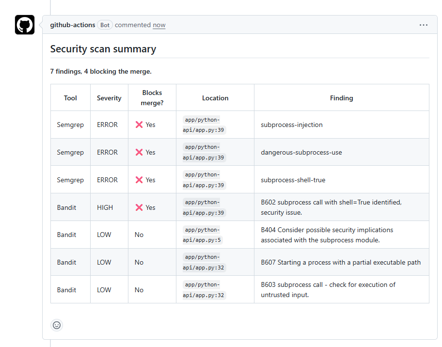
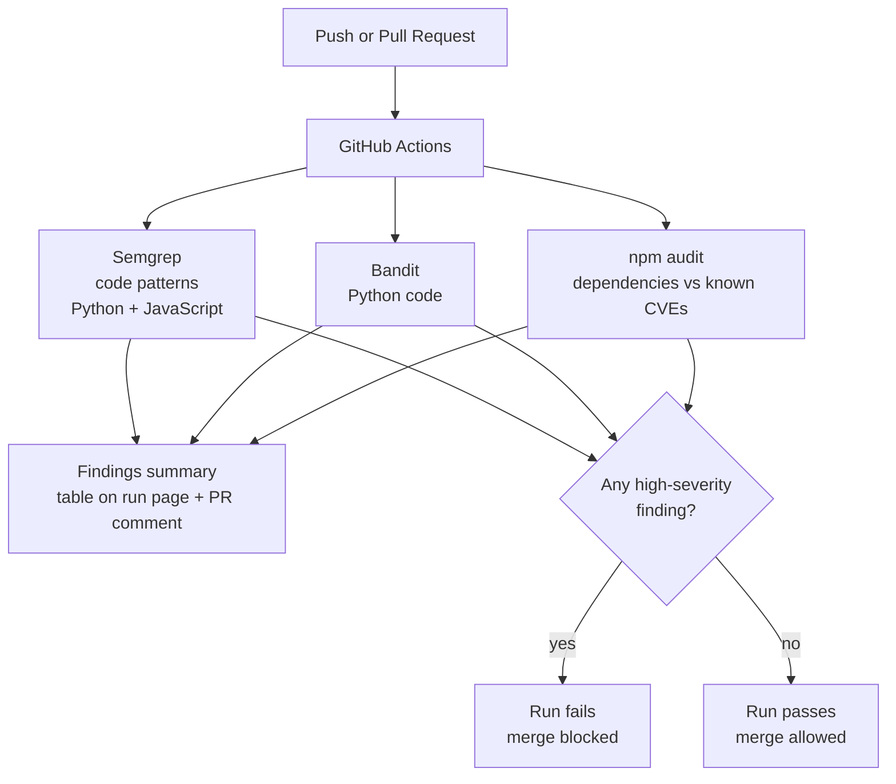
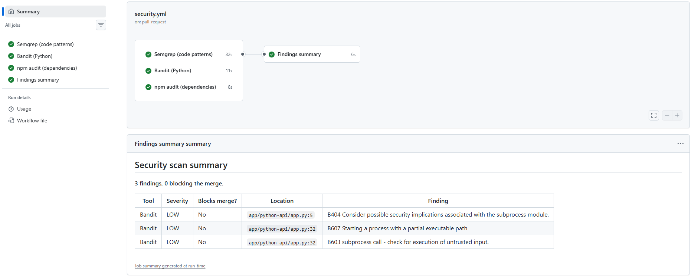
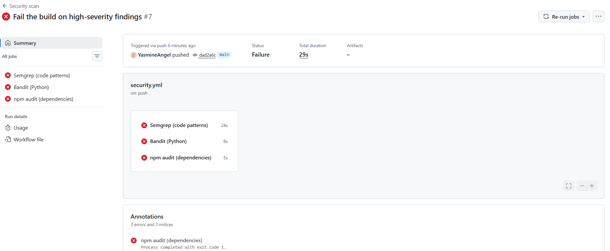
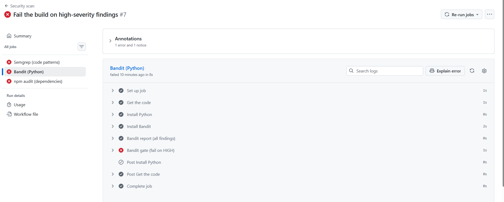
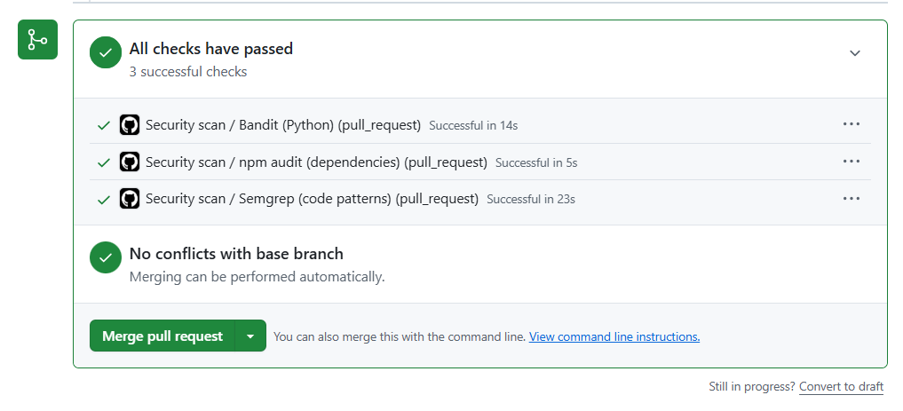
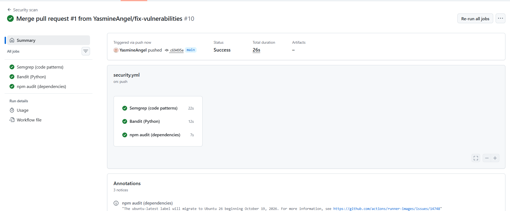
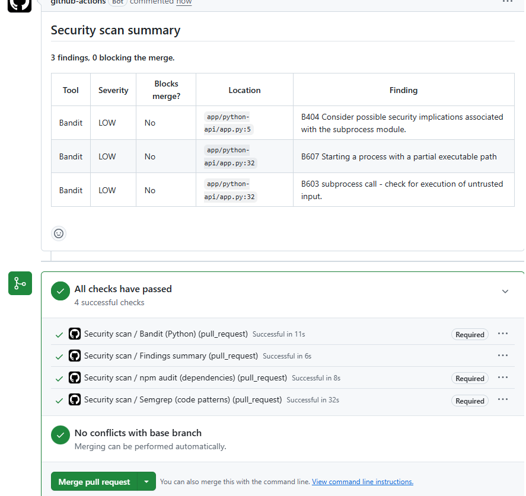
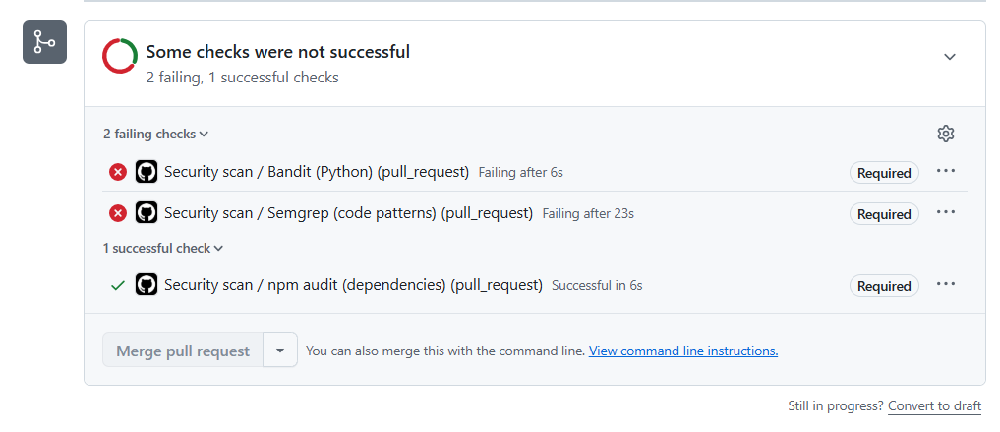
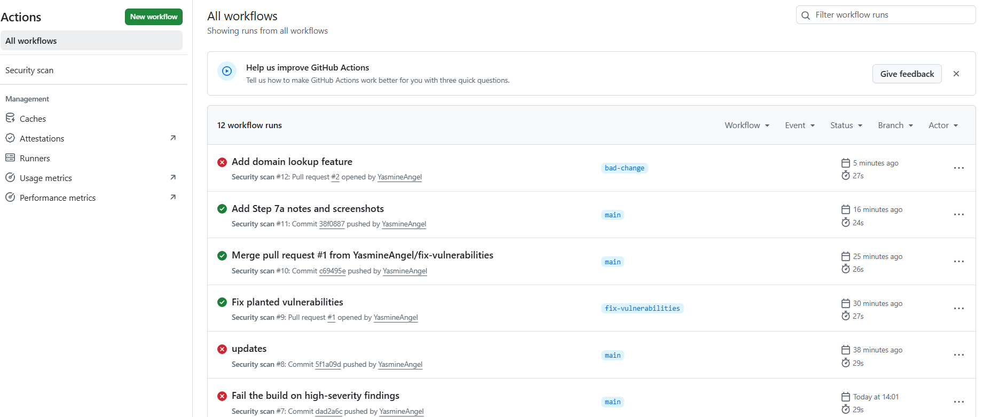

# Security-Gated CI Pipeline (GitHub Actions)


A GitHub Actions pipeline that scans every push and Pull Request with **Semgrep**, **Bandit** and **npm audit**, posts a findings report on each PR, and **blocks the merge** when a high-severity issue is found.



*A rushed change adds a shell command built from user input. The pipeline reports 7 findings, 4 of them blocking, and the merge is refused.*

---

## Why

Security teams can't review every line developers write. A security gate puts automatic checks on the path that all code must travel through, so serious issues are caught **before** they reach `main` ("shifting security left").

## How it works



- The three scanners run **in parallel**. Each one has a **report** step (shows every finding, never blocks) and a **gate** step (fails only on serious issues).
- Each scanner saves its results as JSON in an artifact. A fourth job, **Findings summary**, waits for all three (`needs:`), runs even if they failed (`if: always()`), and turns the results into one Markdown table with [`scripts/summarize.py`](scripts/summarize.py).
- A **branch ruleset** on `main` makes the three scanner checks **required**: nothing can be merged unless they pass.



## What each tool checks

| Tool | Type | What it looks for |
| --- | --- | --- |
| Semgrep | SAST | Risky code patterns in Python and JavaScript (rule packs `p/python`, `p/javascript`) |
| Bandit | SAST | Python-specific security issues |
| npm audit | Dependency scanning (SCA) | Third-party libraries with known vulnerabilities (GHSA / CVE) |

Code scanners can't see a vulnerable library version, and dependency scanners can't see your own bugs. That's why the pipeline uses both.

## Gate rules

| Tool | Blocks on | Setting |
| --- | --- | --- |
| Semgrep | ERROR | `--severity ERROR --error` |
| Bandit | High severity | `-lll` |
| npm audit | High or critical | `--audit-level=high` |

Only high-severity findings block. Lower severities are still reported in the logs and in the summary table. Blocking on every warning causes **alert fatigue**: developers lose trust and start working around the tool.

## Demo: before, after, and a blocked attack

The repo contains a small practice app ([`app/`](app/)) with **5 planted vulnerabilities** and an outdated library:

| # | Planted bug | Where |
| --- | --- | --- |
| 1 | Hardcoded secret | `app/python-api/app.py` |
| 2 | SQL injection (f-string query) | `app/python-api/app.py` |
| 3 | Command injection (`shell=True`) | `app/python-api/app.py` |
| 4 | Flask `debug=True` | `app/python-api/app.py` |
| 5 | `eval()` on user input | `app/node-api/server.js` |
| 6 | lodash 4.17.15 (known vulnerabilities) | `app/node-api/package.json` |

### 1. The gate catches the planted bugs





*Each scanner reports everything (green step), then the gate fails on serious issues only (red step).*

### 2. Fixing the bugs turns the pipeline green

Fixes were made on a branch and merged through [Pull Request #1](https://github.com/YasmineAngel/appsec-ci-security-pipeline/pull/1):

| Bug | Fix |
| --- | --- |
| Hardcoded secret | Read `SECRET_KEY` from an environment variable |
| SQL injection | Parameterized query with a `?` placeholder |
| Command injection | Argument list without `shell=True`, plus IP address validation |
| `debug=True` | Debug only when `FLASK_DEBUG=1` is set |
| `eval()` | `Number()` instead of `eval()` |
| lodash 4.17.15 | Upgraded to 4.18.1 |







### 3. The lock holds

With branch protection on, a "rushed teammate" PR that reintroduces a shell command built from user input is caught by Semgrep and Bandit, and the merge is blocked ([Pull Request #2](https://github.com/YasmineAngel/appsec-ci-security-pipeline/pull/2), closed without merging).





## Results

| | Before fixes | After fixes |
| --- | --- | --- |
| Semgrep | 4 findings (2 ERROR, 2 WARNING) | 0 findings |
| Bandit | 5 issues (2 High, 1 Medium, 2 Low) | 3 issues (all Low) |
| npm audit | 1 high (lodash, 6 advisories) | 0 vulnerabilities |
| Pipeline | ❌ Failure | ✅ Success |

Detection coverage of the planted bugs:

| Planted bug | Semgrep | Bandit | npm audit | Blocks merge? |
| --- | --- | --- | --- | --- |
| Hardcoded secret | ❌ Missed | ✅ Low | — | No, reported only |
| SQL injection | ✅ ERROR | ✅ Medium | — | Yes |
| Command injection | ✅ ERROR | ✅ High | — | Yes |
| `debug=True` | ✅ WARNING | ✅ High | — | Yes |
| `eval()` in JavaScript | ❌ Missed | — | — | No |
| lodash 4.17.15 | — | — | ✅ High | Yes |

The 3 Low findings remaining after the fixes were triaged and accepted:

| Finding | Decision |
| --- | --- |
| B404 `import subprocess` | Reminder only, no risk by itself |
| B603 subprocess call with input | Handled: input must be a valid IP address, no shell |
| B607 partial executable path (`ping`) | Low risk: exploiting it requires control of the server |

## Lessons learned

- **No single tool catches everything.** Semgrep missed the hardcoded secret, which Bandit caught. No tool caught `eval()`.
- **Tools disagree on severity.** `debug=True` is a WARNING for Semgrep but High for Bandit. Choosing gate rules is a real decision.
- **Severity is not confidence.** Bandit reports both: how dangerous an issue is, and how sure it is. The gate only uses severity.
- **"Safe" versions expire.** lodash 4.17.21 was once the recommended fix, but new advisories made it vulnerable too. Dependency scanning has to run on every push, not once.
- **One bug can trigger many alarms.** A single `shell=True` line produced 4 blocking findings across Semgrep and Bandit.
- **Triage matters.** Some findings are reminders, some rules don't fit the framework (a Django rule on a Flask app). A human still decides.

## Known limitations and next steps

- **Hardcoded secrets are reported but not blocked**, since Bandit rates them Low. Next step: add a dedicated secret scanner such as Gitleaks that blocks any secret.
- **`eval()` in `server.js` was not detected.** SAST has blind spots; manual review and additional rules are still needed.
- **Findings are not deduplicated.** Grouping findings by file and line would make reports shorter.
- **SAST doesn't test the running app.** Logic flaws like broken access control need manual review and DAST (for example OWASP ZAP).
- **Repo admins can bypass the ruleset.** Who holds that "emergency key" is a security decision in itself.

## Use it in your own repo

1. Copy [`.github/workflows/security.yml`](.github/workflows/security.yml) and [`scripts/summarize.py`](scripts/summarize.py).
2. Change the scanned paths (`app/python-api`, `app/node-api`) to your own folders.
3. Adjust the Semgrep rule packs to your languages.
4. In **Settings → Rules → Rulesets**, require the three scanner checks on your default branch.

## Repository structure

```
.github/workflows/security.yml   the pipeline
scripts/summarize.py             builds the findings table
app/python-api/                  practice Flask app
app/node-api/                    practice Node.js app
docs/screenshots/                evidence for this README
notes/                           step-by-step notes
```

## ⚠️ Warning

The practice app is for scanning only. Its history contains deliberately vulnerable code. Never deploy it or expose it to the internet. All secrets in it are fake.

## Tools

GitHub Actions · Semgrep · Bandit 1.9 · npm audit (npm 11, Node 24) · Python 3
